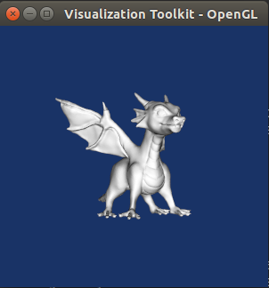
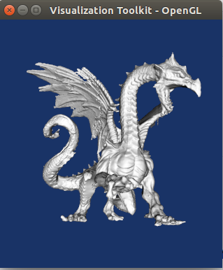

# bazel-large-files-with-girder

The intent of this project is to demonstrate how to integrate download of large
data file from [Girder](http://girder.readthedocs.io) with a [Bazel](https://bazel.build)
based build system.

Note that principle illustrated here are not specific to Bazel, they have already
been successfully implemented in other build system like [CMake](https://cmake.org)
through the use of [ExternalData](https://cmake.org/cmake/help/latest/module/ExternalData.html) module.

### Demo

Possible improvements and know limitations are documented in the [issue tracker](../../issues).

#### Prerequisites

* Linux operating system
* bazel
* git

Note that while this demo is restricted to Linux, support for large data file
using Bazel and Girder can definitively be extended to work on other platform like
MacOSX and Windows.

#### Getting started

##### Setup data server

This is the server where the large file are stored.

1. Setting up Girder server

  * After installing Girder, enable the [Hashsum download](http://girder.readthedocs.io/en/latest/plugins.html#hashsum-download) plugin.

  * create a Collection with a data folder.

2. Upload test data on a Girder server

  * create a [Girder API Key](http://girder.readthedocs.io/en/latest/user-guide.html#api-keys) with at
    least `read_data` and `write_data` scopes.

  * `<folder_id>` used below can be retrieved by browsing to the created folder and
    copying it from the URL. (e.g `590b3cb1739ba64dfc32089e`)

  * test data used in this demo are licensed under the
    [Creative Commons - Attribution - Share Alike](https://creativecommons.org/licenses/by-sa/3.0/)
    license. More details [here](data/README.md).

  ```
  # Download test data
  cd /tmp
  curl -L --progress-bar -o small_dragon.stl -O https://github.com/jcfr/bazel-large-files-with-girder/releases/download/test-data/small_dragon.stl
  curl -L --progress-bar -o large_dragon.stl -O https://github.com/jcfr/bazel-large-files-with-girder/releases/download/test-data/large_dragon.stl

  # Install Girder client
  mkvirtualenv test_data_upload
  pip install girder-client

  # Upload files into data folder
  girder-cli --api-key <API_KEY> --scheme https --host girder.example.org upload <folder_id> small_dragon.stl
  girder-cli --api-key <API_KEY> --scheme https --host girder.example.org upload <folder_id> large_dragon.stl
  ```

##### Download and prepare demo project

* API key for downloading data:

You can definitively reuse the [Girder API Key](http://girder.readthedocs.io/en/latest/user-guide.html#api-keys)
created earlier to upload the test data, or you could create a new one with only
the `read_data` scope.


* Get sources:

  ```
  cd /tmp
  git clone https://github.com/jcfr/bazel-large-files-with-girder.git
  ```

* Configure Girder server address and API key:

  In the context of this demo, Girder server URL and API key are hardcoded in
  [tools/download_data.sh](tools/download_data.sh#L16-L17). Make sure to edit this
  file replace the following string with the own matching your environment:

  * `<GIRDER_SERVER>` .... : Replace with Girder URL, for example `https://girder.example.org`
  
  * `<GIRDER_API_KEY>` ... : Replace with API key created above
   
   
##### Scenario 1: Checkout default branch referencing a small data file

Run test (default branch reference a small STL file of ~8MB)

```
bazel run test:inspect_dragon
```

The small dragon is expected to appear:



Type `CTRL-C` to exit.


Note that while we execute the test outside of the Bazel sandbox using 
`run` (required to allow the viewer to access the DISPLAY environment variable), 
download of girder data is expected to work in a sandboxed environment. It only
 require bash and basic python interpreter.


##### Scenario 2: Checkout revision with an updated data file reference

  
Run test associated with branch `step2-large_dragon` referencing a large STL file (~200MB).

  ```
  git checkout -b step2-small_dragon origin/step2-small_dragon

  bazel run test:inspect_dragon
  ```
  
The large dragon is expected to appear:



Type `CTRL-C` to exit.


### Layout

This source tree is a simple Bazel project organized like this:
 
```
<root>
  |-- WORKSPACE ... : Download stlviewer used in inspect model tests
  |-- data ........ : Key files referencing large data
  |-- test ........ : Tests depending on large data files
  |-- tools  ...... : Girder client script to download large files
```

Note that the inspect model tests are not *legitimate* tests, they simply allow
to interactively visualize which model has been fetched and made available in
the bazel workspace.

The STL model visualization is done by running a simple Linux executable statically
built against VTK. More details [here](thirdparty/stlviewer/README.md).


### Integration with Bazel

#### Overview

The basic idea is to update bazel *test* (or *binary*) targets to depend on *data*
target representing the file to download.
 
In this demo projects, the test `inspect_dragon` depends on a data *target* `//data:dragon.stl`
that will take care of downloading the file from Girder when executing the test.
 
```python
sh_test(
    name = "inspect_dragon",
    srcs = ["inspect_model.sh"],
    args = ["$(location //data:dragon.stl)"],
    data = ["@stlviewerArchive//:stlviewer", "//data:dragon.stl"],
)
```

Note also that the `@stlviewerArchive//:stlviewer` target takes care of
downloading the viewer used in the *test*.

### Specifying Girder server and credentials

TBD

#### Data targets

TBD

#### Uploading new data files

TBD

### F.A.Q

#### How are data files referenced ?

Data files are not directly stored in the source tree managed by the version
control system (e.g git), instead a *key* file containing the *hashsum* of the
original data is tracked.
 
The use of a [cryptographic hash function](https://en.wikipedia.org/wiki/Cryptographic_hash_function)
allows to uniquely represent the data file of arbitrary size with string of a
fixed size called *hashsum*.

We will be using SHA-512 function, a collision resistant implementation belonging to
the [SHA-2](https://en.wikipedia.org/wiki/SHA-2) family of hash algorithms.


For example, the key file associated with file named `large_data_file.ext`
could be stored as:

```
data/large_data_file.ext.sha512
```

and contain a 128-character string like:

```
01fdd890676e9b2f7f5a8eb25c01dcdb168d23e3f9d95f804df44ff235a1c022c8f516a4fe5871f37ebaa2188c640c7624c738c71c5f3965924b7bd2f9bab11b
```
 
 
#### How are data file retrieved ?

Given the *hashsum* contained in the key file, the actual file can be downloaded
from Girder using this API endpoint:

```
https://${server}/api/v1/file/hashsum/sha512/${hashsum}/download
```

where `${hashsum}` corresponds to a 128-character string.


#### What are the advantages over Git-LFS ? 

[Git-lfs](https://git-lfs.github.com/) (Git Large File System) extension also allows
to store *pointer* to files found on a data server.

While this approach is also [leveraging *hashsum*](https://github.com/git-lfs/git-lfs/blob/master/docs/spec.md)
to retrieve the original file, worth noting that by default [all data files](https://github.com/git-lfs/git-lfs/blob/master/docs/man/git-lfs-clone.1.ronn)
are downloaded when git cloning a repository.

Since in our case, we are interested in:

* only running a subset of tests depending on a subset of the data files
* potentially caching the downloads globally

... the git-lfs approach is suboptimal.

Instead, directly integrating with the build system allows to leverage its
dependency resolution mechanism to selectively download files.